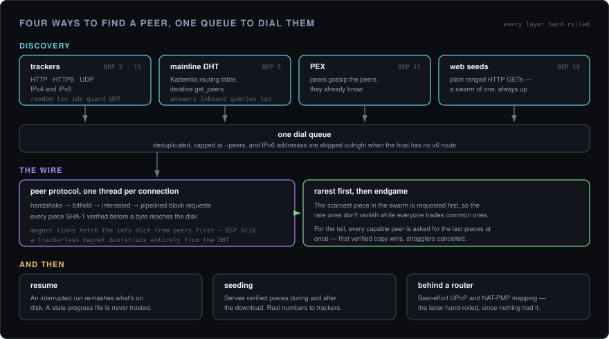

<div align="center">

# bittorrent-rs

**A complete BitTorrent client, written from scratch in Rust.**

Every layer hand-rolled — from the bencode parser up to the mainline DHT — with no `libtorrent`-style crate doing the real work.

<p>
  
  
  
  
  
</p>

<br />


<sub>A swarm is thousands of strangers each holding a few pieces of the same file. This speaks their protocol byte for byte — from the first handshake to the last verified piece.</sub>

</div>

<br />

---

It pulls real public torrents to completion — a 21 GB file, verified byte for byte — and then seeds them back.

## Features

**Wire protocol** — full BEP 3 peer protocol over TCP: handshake, bitfield/have tracking, pipelined block requests, and per-piece SHA-1 verification before a byte touches disk.

**Magnet links** — fetches and verifies the info dict from peers over BEP 9/10 before downloading anything; a trackerless magnet bootstraps entirely from the DHT.

**Four discovery sources, one queue** — trackers (HTTP / HTTPS / UDP, IPv4 + IPv6), the mainline **DHT** (BEP 5: Kademlia routing table, iterative `get_peers`, `announce_peer`, and it answers inbound queries too), **PEX** (BEP 11), and HTTP **web seeds** (BEP 19) all feed a single dial queue.

**Rarest-first + endgame** — grabs the scarcest piece first; for the tail it requests the final pieces from every capable peer at once, first verified copy wins, stragglers cancelled — no 99%-then-crawl.

**Seeding** — serves verified pieces to inbound peers during *and* after the download, reporting real uploaded / downloaded / left to trackers.

**Selective download** — `--only` / `--files` / `--list` to pull just the files you want out of a multi-file torrent.

**Resume** — an interrupted run re-hashes on-disk pieces against the torrent and skips what still checks out; a stale progress file is never blindly trusted.

**Live dashboard** — a `ratatui` TUI with a piece-map heatmap, throughput sparklines, and a colour-coded activity log, backed by a full logfile. Falls back to plain status lines when piped.

**Behind a router** — best-effort UPnP + NAT-PMP port mapping, and it skips IPv6 peers when the host has no v6 route instead of wasting dial slots on them.

## Quickstart

```sh
cargo build --release            # needs a stable Rust toolchain; binary at target/release/download

# a .torrent file or a magnet link
./target/release/download debian-12.8.0-amd64-DVD-1.iso.torrent
./target/release/download "magnet:?xt=urn:btih:HASH&tr=udp://tracker.example:1337"

# list the files, then fetch just one; keep seeding when done
./target/release/download foo.torrent --list
./target/release/download foo.torrent --only .mkv
./target/release/download foo.torrent --seed
```

> Try it against a well-seeded, legal torrent — a current Debian ISO — to watch the piece map fill and every source light up. It's also the honest way to tell a client bug from a simply thin swarm.

Defaults can live in `~/.config/bittorrent-rs.toml` (every key optional; a flag always wins). The flags that matter:

| Flag | Description |
|---|---|
| `--out DIR` | Output directory (default `~/Downloads`) |
| `--peers N` | Max concurrent peer connections (default 30) |
| `--port PORT` | TCP listen + UDP DHT port (default 6881) |
| `--only SUB` · `--files 1,3` · `--list` | Select files in a multi-file torrent |
| `--seed` | Keep seeding until Ctrl-C |
| `--no-dht` · `--no-portmap` · `--no-webseed` | Turn discovery sources off |
| `--quiet` · `--no-tui` | Suppress output · force the plain interface |

## How it works

<div align="center">

</div>

```
  .torrent ─┐
  magnet ───┴─ metadata (BEP 9/10) ─▶ TorrentFile
                                          │
   trackers ─┐                            ▼
   DHT       ├─▶ dial queue ─────▶    WorkQueue    ─▶ peer workers
   PEX       │                     (rarest-first,     web-seed workers (HTTP)
   webseeds ─┘                      endgame)                 │
                                                             ▼
                                          assemble ─▶ verify SHA-1 ─▶ write to disk
                                                             │
                                    seeder ◀─────────────────┘
                               (serve verified pieces to inbound peers)
```

One OS thread per peer and per web seed drains the shared queue — no async runtime, just blocking sockets and channels. Every piece is assembled and SHA-1-verified in memory before it's written, and peer workers and web-seed workers share that exact same verify-write-record path, so hashing, resume, and endgame behave identically no matter where the bytes came from. The DHT node and the inbound seeder each run on their own background thread.

## Tests

259 tests — 256 unit plus 3 integration — all passing, loopback only: bencode / magnet / `.torrent` parsing, the KRPC codec pinned to BEP 5's own example byte strings, DHT lookup / announce / token flows over a scripted in-memory transport, workers driven against mock peers (including a slow-unchoker and a never-unchoker), the seeder against a mock leecher, and the web-seed URL / range math. On top of that, an end-to-end harness runs the real binary against a fake tracker + peer on `127.0.0.1` and diffs the output byte-for-byte, and three `cargo-fuzz` targets hammer the untrusted parsers.

```sh
cargo test
cargo run --bin e2e_harness      # loopback download, byte-for-byte diff
```

## Design notes & limitations

- One thread per peer with blocking I/O — deliberate simplicity at `--peers 30`, not a scaling strategy.
- Seeding unchokes every interested peer up to a connection cap; no tit-for-tat rate measurement.
- DHT is IPv4-only (no BEP 32), with a fixed-bucket routing table and a single non-rotating announce-token secret per run.
- Under `--only`, a piece straddling a selected and an unselected file is fetched whole, so a neighbour file may be left partially written (standard client behaviour).
- No partial-piece resume across peers — a peer dropping mid-piece loses that connection's progress on it; whole verified pieces from earlier runs still resume.

## Layout

```
src/
  bencode.rs        BEP 3 decoder (+ lenient wire mode) and encoder
  torrent.rs        .torrent parsing, exact-byte InfoHash
  magnet*.rs        magnet URIs + BEP 9/10 metadata fetch
  tracker/          HTTP, HTTPS (rustls), UDP announce
  dht/              mainline DHT — KRPC, Kademlia routing table, lookups
  peer/             handshake, wire messages, PEX, extension protocol
  downloader/       work queue (rarest-first + endgame), piece assembler, file writer, resume
  seeder.rs         inbound listener serving verified pieces
  webseed.rs        BEP 19 HTTP web-seed workers
  portmap.rs        UPnP + NAT-PMP port mapping
  selection.rs      --only / --files piece selection
  config.rs         optional TOML config
  tui.rs, ui.rs     live terminal dashboard
  bin/download.rs   the CLI that ties it all together
fuzz/               bencode / magnet / torrent parser fuzz targets
```

## License

MIT

## Contributors

| Contributor | Role |
|-------------|------|
| [chakri192](https://github.com/chakri192) | Author |
| [aider](https://github.com/Aider-AI/aider) | AI pair programmer |

### AI tooling

README and code contributions assisted by [aider](https://github.com/Aider-AI/aider) using local LLMs via [Ollama](https://ollama.com):

| Model | Used for |
|-------|----------|
| `qwen2.5-coder:7b` | Code suggestions, refactoring |
| `llama3.1:8b` | Prose, documentation, commit messages |
