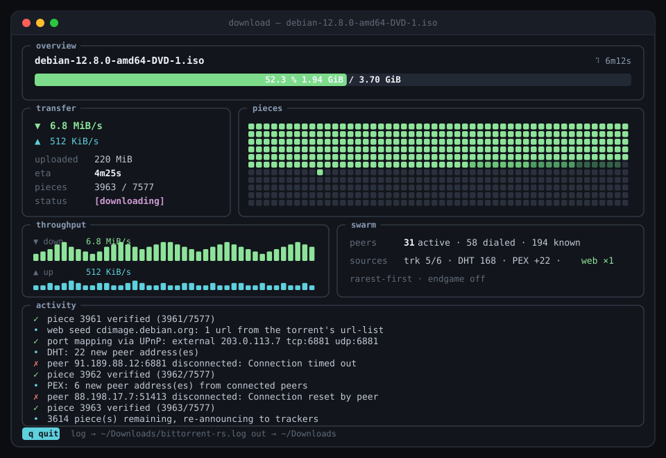

<div align="center">

# bittorrent-rs

**A complete BitTorrent client implemented from the specifications in Rust.**

Every layer is written here — the bencode parser, the peer wire protocol, tracker communication, the mainline DHT, and piece selection. No `libtorrent`-style crate performs any part of the work.

<p>
  
  
  
  
  
  
</p>

<br />



</div>

---

## Overview

bittorrent-rs downloads and seeds torrents using the standard BitTorrent protocol suite. It accepts both `.torrent` files and magnet links, discovers peers through four independent mechanisms, verifies every piece against the torrent's SHA-1 hashes before writing, and serves completed pieces back to the swarm.

It has been validated against real public torrents, including a 21 GB distribution image verified byte for byte on completion.

## Specifications implemented

| BEP | Title | Scope |
|---|---|---|
| 3 | The BitTorrent Protocol | Bencode, `.torrent` parsing, peer wire protocol, HTTP trackers |
| 5 | DHT Protocol | Kademlia routing table, iterative `get_peers`, `announce_peer`, inbound query handling |
| 9 / 10 | Metadata Exchange · Extension Protocol | Retrieving the info dictionary from peers for magnet links |
| 11 | Peer Exchange | Peer discovery through connected peers |
| 27 | Private Torrents | Honours the `private` flag: tracker-only peer discovery, no DHT or PEX |
| 15 | UDP Tracker Protocol | Connectionless tracker announces |
| 19 | WebSeed — HTTP/FTP Seeding | Ranged HTTP retrieval from web servers |

## Requirements

Rust 1.88 or newer (the floor set by the locked dependency graph, and checked in CI). No system libraries beyond those the listed crates require.

## Installation

```sh
git clone https://github.com/chakri192/bittorrent-rs.git
cd bittorrent-rs
cargo build --release
```

The resulting binary is `target/release/download`.

## Usage

```sh
# A .torrent file
./target/release/download debian-12.8.0-amd64-DVD-1.iso.torrent

# A magnet link
./target/release/download "magnet:?xt=urn:btih:HASH&tr=udp://tracker.example:1337"

# Inspect contents, retrieve a subset, and continue seeding
./target/release/download foo.torrent --list
./target/release/download foo.torrent --only .mkv
./target/release/download foo.torrent --seed
```

A well-seeded, legally distributed torrent such as a current Debian image is the appropriate test case. It exercises all four discovery mechanisms and distinguishes a client defect from a sparsely populated swarm.

### Options

Defaults may be placed in `~/.config/bittorrent-rs.toml`. Every key is optional, and a command-line flag always takes precedence.

| Flag | Description |
|---|---|
| `--out DIR` | Output directory. Defaults to `~/Downloads` |
| `--peers N` | Maximum concurrent peer connections. Defaults to 30 |
| `--port PORT` | TCP listen and UDP DHT port. Defaults to 6881 |
| `--only SUB` · `--files 1,3` · `--list` | File selection within a multi-file torrent |
| `--seed` | Continue seeding after completion until interrupted |
| `--seed-ratio R` · `--seed-time T` | Stop seeding by itself once `R` times the torrent's size has been uploaded (`1`, `2.5`), or after `T` (`90`, `30m`, `12h`, `1d`, `1h30m`), whichever comes first. Either one turns `--seed` on. Also settable as `seed_ratio` and `seed_time` in the config file |
| `--save-torrent FILE` | Write the torrent to `FILE` as a `.torrent`: for a magnet link, what its metadata resolved to (with the link's trackers), so the metadata exchange is not needed next time. An existing file is replaced; it is written whole or not at all |
| `--json` | Write status as JSON lines on stdout instead of a dashboard, for scripts (see below). Not with `--quiet` |
| `--prefer SUBSTR` | Fetch the pieces of files whose path contains `SUBSTR` (case-insensitive, repeatable) before all others, rarest first within each group; still downloads everything else. A pattern that matches no file is an error. Unlike `--only`, which leaves the other files out |
| `--sequential` | Fetch pieces in order instead of rarest first, so a file can be played while it downloads. It gives up the swarm-health benefit of rarest-first, so leave it off for anything you are not previewing |
| `--recheck` | Verify every piece against the files on disk instead of trusting the resume file. This also happens by itself when files exist but no resume file does, so a finished download can be re-verified and seeded, and files from elsewhere adopted |
| `--no-dht` · `--no-portmap` · `--no-webseed` | Disable individual discovery mechanisms |
| `--max-down RATE` · `--max-up RATE` | Limit download / upload speed across all connections, e.g. `500K`, `1.5M` (binary units, bytes per second). Applies to peers and web seeds |
| `--retry-delay SECS` | First wait before redialing a peer that failed; later retries wait 3× and 9× as long. Defaults to 15 |
| `--quiet` · `--no-tui` | Suppress output · force the plain text interface |

Ctrl-C and `SIGTERM` stop the client cleanly whether or not there is a terminal: the listener and DHT stop, the router's port mapping is removed, the trackers are told the client is leaving (BEP 3 `stopped`), and the resume file is kept. Every connection is shut down at once, and waits on a silent web seed or a slow `--max-down` are cut short, so nothing that has gone quiet delays the stop, and a tracker that does not answer `stopped` is waited for at most three seconds. A second signal exits immediately (status 130).

### Machine-readable output

With `--json` stdout is nothing but JSON objects, one per line, each with an `"event"` field; the human log still goes to the log file and errors to stderr.

```sh
./target/release/download foo.torrent --json | while read -r line; do ... done
```

| Event | When | Fields |
|---|---|---|
| `torrent` | once, when the torrent is known | `name`, `info_hash`, `total_bytes`, `pieces` |
| `progress` | every second, and once more at the end | `status`, `percent`, `done_bytes`, `total_bytes`, `verified_pieces`, `total_pieces`, `down_bytes_per_sec`, `up_bytes_per_sec`, `uploaded_bytes`, `peers`, `peers_dialed`, `peers_known`, `trackers_ok`, `trackers_total`, `dht_nodes`, `web_seeds`, `eta_seconds` (`null` when unknown), `elapsed_seconds`, `endgame` |
| `file` | with `--list`, one per file | `index` (from 1, as `--files` counts), `path`, `bytes`, `selected` |
| `done` · `error` · `stopped` | last, exactly one | `summary` · `message` · none |

`status` is one of `connecting`, `waiting`, `downloading`, `endgame`, `complete` and `seeding`. An interrupted run ends with `stopped` and exits 0, as it does without `--json`; a failure ends with `error` and exits 1.

### Making a torrent

`create_torrent` is the other direction: it hashes a file or a directory and writes the `.torrent`.

```sh
./target/release/create_torrent ~/Videos/holiday --announce http://tracker.example/announce
./target/release/create_torrent ./album --announce "udp://a:1337,udp://b:6969" --announce http://c/announce \
    --web-seed https://mirror.example/album/ --piece-length 1M --private --comment "for the group"
```

| Flag | Description |
|---|---|
| `--out FILE` | Where to write. Defaults to `<name>.torrent`; an existing file is not replaced without `--force` |
| `--announce URLS` | One tier of trackers (BEP 12), comma-separated; give the flag again for another tier |
| `--web-seed URL` | A BEP 19 web seed; repeatable |
| `--piece-length SIZE` | A power of two from `1K` to `128M`. By default chosen to give about 1500 pieces, between 16 KiB and 16 MiB |
| `--private` | Sets the BEP 27 flag: no DHT, no peer exchange. It is part of the info dictionary, so it changes the info hash |
| `--comment TEXT` · `--name NAME` | A comment; a name other than the file's or directory's |
| `--no-date` | Leave out the creation date, so the same input always gives the same file |

Files are listed in path order, so the result is reproducible. Symbolic links are skipped instead of followed, and file names that are not valid UTF-8 are refused.

## Architecture

This section is the short version; [docs/ARCHITECTURE.md](docs/ARCHITECTURE.md) covers the threads, the life of a download, the rules that hold everywhere and how the tests are layered.

```
  .torrent ─┐
  magnet ───┴─ metadata (BEP 9/10) ─▶ TorrentFile
                                          │
   trackers ─┐                            ▼
   DHT       ├─▶ dial queue ─────▶    WorkQueue    ─▶ peer workers
   PEX       │                     (rarest-first,     web-seed workers (HTTP)
   webseeds ─┘                      endgame)                 │
                                                             ▼
                                          assemble ─▶ verify SHA-1 ─▶ write to disk
                                                             │
                                    seeder ◀─────────────────┘
```

### Concurrency model

One operating-system thread per peer connection and per web seed, drawing from a shared work queue. There is no async runtime; the implementation uses blocking sockets and channels. The DHT node and the inbound seeder each occupy a dedicated background thread.

This is a deliberate simplification appropriate to the default connection limit of 30. It is not a design intended to scale to thousands of concurrent peers.

### Peer discovery

Four mechanisms feed a single deduplicated dial queue. IPv6 addresses are excluded when the host has no IPv6 route, rather than consuming connection slots on unreachable peers. UDP tracker transactions use cryptographically random identifiers, the anti-spoofing measure the connectionless protocol depends on.

### Piece selection

The scarcest piece in the swarm is requested first, so rare pieces do not become unavailable while common ones circulate. "Scarcest" is judged among the pieces the peer being asked actually has: a peer holding only common pieces is given those rather than left waiting on a rare one it could never supply. For the final pieces, requests go to every capable peer at once; the first verified copy is accepted and the rest cancelled, avoiding the extended tail near completion.

### Request pipelining

A request pays off one round trip after it is sent, so a queue of a fixed length caps a peer's throughput at `queue * 16 KiB / round-trip time`: five requests over a 100 ms link is 800 KB/s however fast the peer is. Each connection therefore sizes its queue from what the peer is delivering: enough requests to cover two seconds of data at the measured rate, never fewer than five, and never more than the peer said it will queue (`reqq` in its extended handshake, or 64 when it says nothing). Against a peer with a 20 ms round trip this fetches 4 MiB in about a quarter of the time a queue of two would need.

A peer that chokes the client mid-piece discards every request it has not answered yet, and does not send them after unchoking. The worker forgets them too, stops asking while choked, waits for the unchoke (as long as it waits for one when connecting, about a minute at the default timeout, sending keep-alives), and then asks again for just the blocks that had not arrived, keeping the ones that had.

### Verification

Pieces are assembled and verified against the torrent's SHA-1 hashes in memory before any data reaches the filesystem. Peer and web-seed workers share that path, so hashing, resume, and endgame behave identically regardless of transport.

An interrupted transfer re-hashes what is on disk and retains what remains valid; a stored progress file is never trusted without verification.

## Interface

A `ratatui` dashboard with a piece-map heatmap, throughput sparklines, and an activity log, backed by a full logfile. Piped output falls back to plain status lines automatically; `--no-tui` forces it.

## Testing

```sh
cargo test
cargo run --bin e2e_harness      # loopback scenarios: public, private, magnet, hostile torrent, resume, --only, dropped peer, retry, ban, --timeout, --seed
```

678 tests (676 unit, 1 integration, 1 doctest), all passing, all confined to loopback.

Coverage spans parsing, the KRPC codec verified against BEP 5's published byte strings, DHT lookup and announce over a scripted transport, workers driven against mock peers, the seeder against a mock leecher, and web-seed range arithmetic. An end-to-end harness runs the real binary against a synthetic tracker and peer on `127.0.0.1` and compares output byte for byte. Its scenarios cover a public torrent, a hostile one whose paths would write outside the download directory (it must be refused with nothing written), a private one (no DHT, no PEX), a client killed mid-download that must resume and fetch only the pieces it lacks, `--only` on one file of three (only the pieces that file touches may be requested), a tracker that redirects every announce (followed), a torrent's empty files (created though no piece contains them, and only the selected ones under `--only`), a disk that cannot be written to (the run ends at once and blames the disk, not the swarm), a peer that hangs up halfway through a piece while another supplies the rest (asked only for the block that had not arrived), and `--timeout` against a peer that goes silent (the client must stop, exit non-zero, report the download incomplete and keep its resume file), `--seed` (the client announces started and completed, stays up, and serves every piece back to a leecher on the port it announced), two peers that each have only part of the torrent (the client must combine them and ask each only for what it has), a leecher connected to the client's listener before the download began (it must be told of each piece as the client verifies it, once each), `--prefer` (the preferred file's pieces requested before the rest, a typo refused before any request), `--seed-ratio` (still seeding at half the ratio, gone once the whole torrent has been uploaded) and `--seed-time`, a magnet link (a peer found through the tracker serves the metadata, which the client verifies before downloading, and `--save-torrent` keeps a torrent with the same info hash), `--json` (nothing but JSON on stdout for a download, a failure, a `--list` and an interruption), the only peer dropping the first connection (the client must dial it again and finish), a peer that sends corrupt data beside an honest one (the download must be correct and the liar dialed exactly once), a finished download run again (verified in place, nothing fetched), one with a single damaged piece (exactly that piece fetched), `--max-down` / `--max-up` (a download and a leecher's pull must each take as long as the limit says, with every byte still correct), `create_torrent` on a directory (it must make the same info hash as an independent builder in the harness, refuse to overwrite, and produce a torrent the client downloads byte for byte), and real SIGINT and SIGTERM sent to the running binary (a clean stop with status 0, the resume file kept and the tracker told what was left, within a few hundred milliseconds even while the only peer is silent; a tracker that ignores the `stopped` announce delays the exit by about three seconds and no more, and a second signal during that wait exits at once with status 130). Every parser that reads untrusted bytes also runs through a deterministic mutation fuzzer inside `cargo test` (bit flips, every truncation, extreme lengths, splices), which must never panic and must round-trip whatever it accepts; eight `cargo-fuzz` targets do the same open-ended on a nightly toolchain.

## Security

The client treats everything from the network, and every `.torrent` or magnet link, as hostile. What it defends against, each with a test that fails when the defence is removed:

| Attack | Defence |
|---|---|
| A torrent naming `../../.ssh/authorized_keys`, or an absolute path, to write outside the download directory | The name and every path component must be exactly one ordinary path component; the torrent is refused before any network use |
| Deeply nested bencode (`llll…`) overflowing the stack in a peer's handshake, a tracker reply or a DHT datagram | Nesting is limited to 100 levels |
| A peer advertising a huge `metadata_size` to make magnet resolution allocate without bound | Accepted only between 1 byte and 16 MiB |
| A `have` for piece 4294967295 (or an oversized bitfield) growing per-peer state to 4 GiB | Tracked only up to the torrent's real piece count |
| A tracker streaming an endless HTTP response, or sending a chunk size that overflows | Responses capped at 4 MiB; chunk arithmetic checked |
| A `.torrent` whose piece count, lengths or piece length do not add up | Cross-checked when parsed; piece length capped at 128 MiB |
| One announcing many info-hashes to grow the DHT node's memory | At most 1000 remembered |
| A panic in one thread poisoning shared state for all of them | Locks recover the data rather than propagate the panic |
| A peer sending pieces that fail verification, again and again | Banned for the session after the first bad piece (never redialed, even if announced again) |

`unwrap()` and `expect()` are linted against in non-test code, so a new way to panic on network input has to be argued for.

## Limitations

- **One thread per peer with blocking I/O.** Appropriate at the default connection limit; not a scaling strategy.
- **Seeding unchokes every interested peer** up to the connection cap. There is no tit-for-tat rate measurement.
- **The DHT is IPv4-only** (BEP 32 is not implemented), and uses a fixed-bucket routing table.
- **Under `--only`, a piece spanning a selected and an unselected file is retrieved in full**, which may leave an adjacent file partially written. This matches standard client behaviour.
- **Magnet links to private torrents use the DHT briefly.** The `private` flag lives in the info dict, which a magnet link does not carry, so the DHT runs while the metadata is fetched and is shut down as soon as the flag is seen. A `.torrent` file never touches the DHT.
- **Partial pieces are handed on within a run, not across runs.** When a peer fails part-way through a piece, the blocks it delivered are kept in memory (up to 64 MiB) and the next peer asked only for the rest; but a run that is stopped forgets them, and only complete verified pieces resume from disk.

## Network configuration

Port mapping is attempted on a best-effort basis through UPnP and NAT-PMP. The NAT-PMP implementation is written here, as no suitable crate provided it. Mapping failure is not fatal; the client continues with outbound connections only.

## Project structure

```
src/
├── bencode.rs        BEP 3 decoder with lenient wire mode, and encoder
├── create.rs         Making a .torrent from files on disk
├── json.rs           JSON lines for --json, and a strict reader to check them
├── torrent.rs        .torrent parsing, exact-byte infohash computation
├── magnet*.rs        Magnet URIs and BEP 9/10 metadata retrieval
├── tracker/          HTTP, HTTPS (rustls), and UDP announce
├── dht/              Mainline DHT — KRPC codec, routing table, responder, lookups, service
├── peer/             Handshake, wire messages, PEX, extension protocol
├── downloader/       Work queue, piece assembler, file writer, resume
├── seeder.rs         Inbound listener serving verified pieces
├── webseed.rs        BEP 19 HTTP workers
├── portmap.rs        UPnP and NAT-PMP port mapping
├── selection.rs      File selection logic
├── session/          Setup and the download loop: magnet resolution, prepare, workers, announcer
├── config.rs         Optional TOML configuration
├── tui.rs · ui.rs    Terminal dashboard
└── bin/              download (the client), create_torrent, and two helpers

fuzz/                 Bencode, magnet, and torrent parser fuzz targets
```

## License

MIT

## Contributors

| | |
|---|---|
| [chakri192](https://github.com/chakri192) | Author |
| [aider](https://github.com/Aider-AI/aider) | AI pair programmer |
