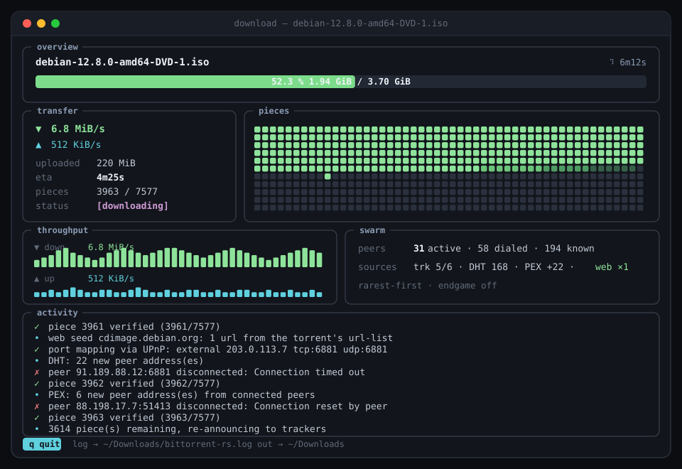

# bittorrent-rs

A BitTorrent client written from scratch in Rust. It downloads and seeds from `.torrent` files and magnet links, can run many torrents at once as a background daemon, and can create new torrents.



## Install

Needs Rust 1.88 or newer.

```sh
git clone https://github.com/chakri192/bittorrent-rs.git
cd bittorrent-rs
cargo build --release
```

This builds `download`, `daemon`, and `create_torrent` in `target/release/`. The examples below use those paths.

To run them by name from anywhere instead, install them to `~/.cargo/bin`:

```sh
cargo install --path .
```

## Download a torrent

```sh
./target/release/download ubuntu.iso.torrent
./target/release/download "magnet:?xt=urn:btih:HASH&tr=udp://tracker.example:1337"
```

Files are saved to `~/Downloads`. A live dashboard shows progress, speed, and peers.

More examples:

```sh
./target/release/download foo.torrent --list              # list the files
./target/release/download foo.torrent --only .mkv         # download only matching files
./target/release/download foo.torrent --seed              # keep seeding when done
./target/release/download foo.torrent --verify            # check downloaded files are complete
./target/release/download foo.torrent --max-down 2M       # limit download speed
```

Press Ctrl-C to stop. Running the same command again resumes where it left off.

### Options

| Option | |
|---|---|
| `--out DIR` | Where to save (default `~/Downloads`) |
| `--list` | List the files and exit |
| `--only TEXT` | Download only files whose name contains TEXT |
| `--files 1,3` | Download only these files (numbers from `--list`) |
| `--prefer TEXT` | Download matching files first, then the rest |
| `--sequential` | Download in order, so a video can be watched while downloading |
| `--seed` | Keep seeding after the download finishes |
| `--seed-ratio R`, `--seed-time T` | Stop seeding after uploading R × the size, or after time T (e.g. `2`, `12h`) |
| `--verify` | Check files on disk and exit |
| `--recheck` | Re-check existing files before downloading |
| `--max-down RATE`, `--max-up RATE` | Speed limits, e.g. `500K`, `2M` |
| `--peers N` | Maximum connections (default 30) |
| `--port PORT` | Port to use (default 6881) |
| `--scrape` | Show how many seeders and leechers a torrent has, then exit |
| `--save-torrent FILE` | Save a magnet link as a `.torrent` file |
| `--encryption prefer\|require` | Encrypt connections |
| `--transport utp\|both` | Also use uTP connections |
| `--no-dht`, `--no-lsd`, `--no-portmap`, `--no-webseed` | Turn off a way of finding peers |
| `--timeout SECS` | Give up after this many seconds |
| `--json` | Output progress as JSON lines, for scripts |
| `--quiet`, `--verbose` | Less or more output |

Default options can be saved in `~/.config/bittorrent-rs.toml`, for example:

```toml
out = "/Volumes/Media"
seed_ratio = 2.0
encryption = "prefer"
```

## Run many torrents at once

The daemon runs in the background and handles any number of torrents.

```sh
./target/release/daemon run &                                   # start
./target/release/daemon add ubuntu.torrent --out ~/Downloads    # add a torrent or magnet link
./target/release/daemon list                                    # show all torrents
./target/release/daemon status 3f2a                             # details for one (first few characters of its ID)
./target/release/daemon pause 3f2a
./target/release/daemon resume 3f2a
./target/release/daemon remove 3f2a                             # stop it; downloaded files are kept
./target/release/daemon stop                                    # shut down
```

Torrents are remembered across restarts. `daemon run` accepts the same speed, port, and seeding options as `download`.

## Create a torrent

```sh
./target/release/create_torrent ~/Videos/holiday --announce http://tracker.example/announce
./target/release/create_torrent ./album --announce udp://tracker.example:1337 --private --comment "for the group"
```

| Option | |
|---|---|
| `--out FILE` | Output file (default `<name>.torrent`) |
| `--announce URLS` | Tracker addresses |
| `--web-seed URL` | A web server that also hosts the files |
| `--piece-length SIZE` | Piece size, e.g. `1M` (chosen automatically by default) |
| `--private` | Private torrent: trackers only |
| `--v2` | Create a BitTorrent v2 torrent |
| `--comment TEXT`, `--name NAME` | Comment, or a different name |
| `--force` | Overwrite an existing file |

## Features

- `.torrent` files and magnet links
- Finds peers through trackers (HTTP, HTTPS, UDP), DHT, peer exchange, the local network, and web seeds
- Every piece is checked before it's saved
- Resumes interrupted downloads
- Encrypted connections and uTP
- BitTorrent v2 and hybrid torrents
- IPv6
- Automatic port forwarding (UPnP and NAT-PMP)
- Tested with Transmission, aria2, and libtorrent (used by qBittorrent)

## Tests

```sh
cargo test
```

## License

MIT

## Contributors

| | |
|---|---|
| [chakri192](https://github.com/chakri192) | Author |
| [aider](https://github.com/Aider-AI/aider) | AI pair programmer |
